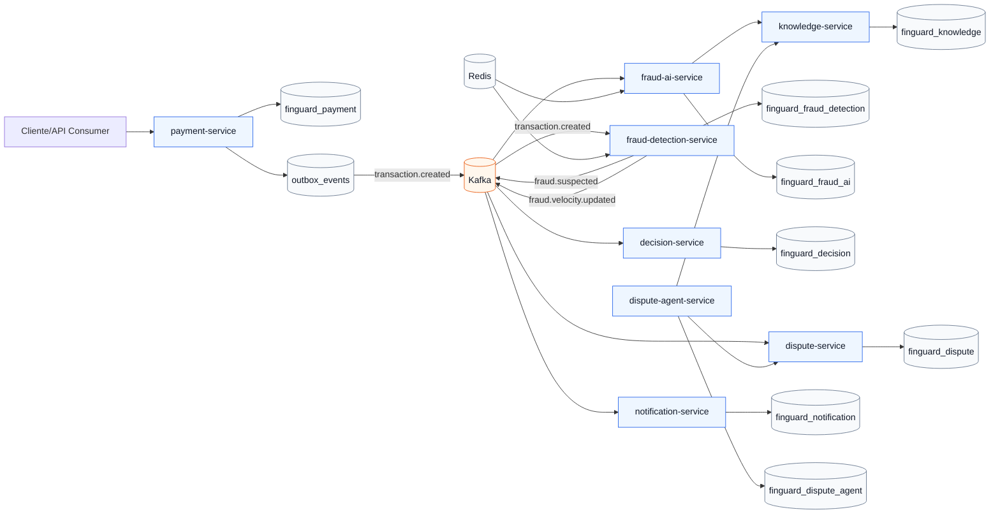

# FinGuard AI

FinGuard AI e uma plataforma backend de portfolio para deteccao de fraude, investigacao assistida por IA e inteligencia de disputas financeiras.

O projeto nasce como um monorepo Maven em Java 25, com servicos Spring Boot independentes e comunicacao orientada a eventos. A IA entra como camada de investigacao e recomendacao, sempre auditavel e sem permissao direta para mover dinheiro, aprovar chargebacks, bloquear contas ou executar reembolsos.

## Estado atual

Fase 4 em andamento: Kafka Streams calcula sinais de velocidade por janela e o `fraud-detection-service` incorpora alto volume recente ao score de fraude.

## Modulos

- `libs/event-contracts`: contratos de eventos compartilhados.
- `libs/common-observability`: base para correlacao e observabilidade compartilhada.
- `services/payment-service`: entrada e consulta de transacoes.
- `services/fraud-detection-service`: regras deterministicas de fraude.
- `services/fraud-ai-service`: investigacao assistida por IA.
- `services/dispute-service`: ciclo de vida de disputas.
- `services/dispute-agent-service`: agentes de disputa e coleta de evidencias.
- `services/decision-service`: politicas deterministicas de decisao.
- `services/knowledge-service`: base de conhecimento e RAG.
- `services/notification-service`: notificacoes operacionais.

## O que cada servico faz

`payment-service` recebe transacoes, valida os dados de entrada, persiste o registro financeiro e grava o evento `TransactionCreated` na outbox. Ele e o ponto inicial do fluxo e nao decide fraude sozinho.

`fraud-detection-service` consome `TransactionCreated`, aplica regras deterministicas de fraude e calcula score de risco. Quando a transacao fica em risco medio ou alto, registra um caso de fraude e publica `FraudSuspected`.

`fraud-ai-service` sera responsavel por investigacoes assistidas por IA. Ele deve explicar sinais suspeitos, sugerir proximas acoes e usar ferramentas apenas para leitura, sem autoridade para executar decisoes financeiras.

`dispute-service` cuidara do ciclo de vida das disputas, incluindo abertura, analise, evidencias, prazos, estados e revisao humana.

`dispute-agent-service` orquestrara agentes voltados a disputas, como coleta de evidencias, organizacao de contexto e apoio a analistas. Ele trabalha sobre dados auditaveis e nao aprova chargebacks diretamente.

`decision-service` concentrara politicas deterministicas de decisao. Ele transforma sinais de fraude, IA, disputas e regras de negocio em recomendacoes ou decisoes permitidas pelo fluxo.

`knowledge-service` mantera a base de conhecimento usada por RAG, com documentos, politicas, embeddings e citacoes. Ele ajuda os servicos de IA a responder com contexto rastreavel.

`notification-service` enviara comunicacoes operacionais, como alertas de fraude, eventos de disputa e notificacoes internas para revisao humana.

## Resiliencia de eventos

O `payment-service` usa outbox transacional para evitar perda de eventos: a transacao e o evento `TransactionCreated` sao gravados na mesma transacao de banco. Um publisher agendado tenta publicar eventos pendentes no Kafka, registra tentativas, guarda o ultimo erro e marca o evento como `FAILED` quando excede o limite configurado.

O `fraud-detection-service` usa uma tabela de transacoes processadas para evitar reprocessamento do mesmo `transactionId`. Falhas no consumo de `transaction.created` passam por retry com backoff fixo e, se continuarem falhando, sao enviadas para `transaction.created.dlt`.

Metricas Micrometer acompanham publicacoes da outbox, falhas da outbox, mensagens consumidas, mensagens publicadas e mensagens enviadas para DLT.

## Velocidade de transacoes

O `fraud-detection-service` usa Kafka Streams para agregar `transaction.created` em janelas de 10 minutos por cliente. Cada atualizacao gera `FraudVelocityUpdated` em `fraud.velocity.updated`.

O proprio servico consome esse evento, persiste o snapshot em `velocity_snapshots` e usa o sinal `CUSTOMER_VELOCITY` no motor de regras quando o volume recente do cliente ultrapassa o limite configurado no codigo da fase.

Sinais de recusas em janela curta ainda dependem de eventos de transacao recusada, que serao adicionados quando o fluxo de autorizacao ganhar estados de recusa.

## Arquitetura



## Requisitos locais

- Java 25
- Maven 3.6.3 ou superior
- Docker
- Docker Compose

## Como validar

```bash
./mvnw clean verify
docker compose config
docker compose up -d
```

Depois que os servicos forem iniciados localmente, cada aplicacao expoe:

```text
GET /actuator/health
```

Portas locais planejadas:

- `payment-service`: `8081`
- `fraud-detection-service`: `8082`
- `fraud-ai-service`: `8083`
- `dispute-service`: `8084`
- `dispute-agent-service`: `8085`
- `decision-service`: `8086`
- `knowledge-service`: `8087`
- `notification-service`: `8088`

## Infraestrutura local

O `docker-compose.yml` sobe:

- PostgreSQL 17 na porta `5432`
- Kafka na porta `29092`
- Redis na porta `6379`

O PostgreSQL cria bancos separados por servico. Esta separacao protege a regra de ownership: um servico nao consulta tabelas internas de outro servico.

## Decisoes arquiteturais

As decisoes iniciais estao em `docs/adr`:

- ADR 0001: monorepo Maven
- ADR 0002: arquitetura orientada a eventos
- ADR 0003: IA sem autoridade transacional
- ADR 0004: ownership de dados por servico
- ADR 0005: resiliencia de eventos
- ADR 0006: sinais de velocidade com Kafka Streams
