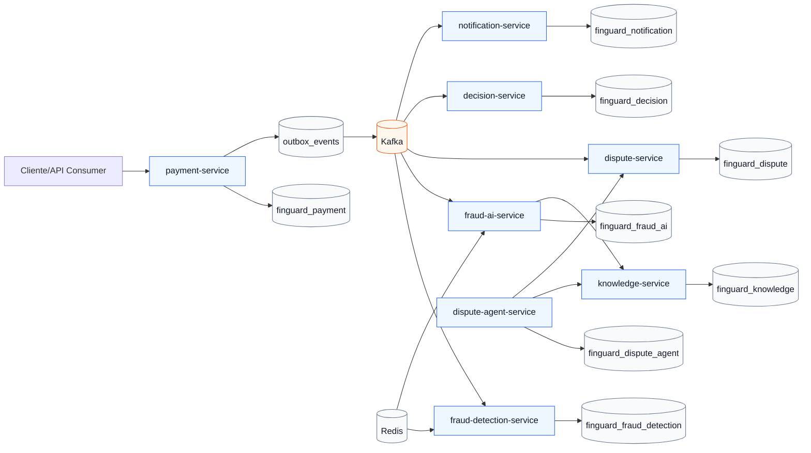

# FinGuard AI

FinGuard AI e uma plataforma backend de portfolio para deteccao de fraude, investigacao assistida por IA e inteligencia de disputas financeiras.

O projeto nasce como um monorepo Maven em Java 25, com servicos Spring Boot independentes e comunicacao orientada a eventos. A IA entra como camada de investigacao e recomendacao, sempre auditavel e sem permissao direta para mover dinheiro, aprovar chargebacks, bloquear contas ou executar reembolsos.

## Estado atual

Fase 1 em andamento: `payment-service` com criacao/consulta de transacoes, persistencia PostgreSQL, Flyway e outbox para publicacao de `TransactionCreated` no Kafka.

## Modulos

- `libs/event-contracts`: contratos de eventos compartilhados.
- `libs/common-observability`: base para correlacao e observabilidade compartilhada.
- `services/payment-service`: entrada e consulta de transacoes.
- `services/fraud-detection-service`: regras deterministicas de fraude.
- `services/fraud-ai-service`: investigacao assistida por IA.
- `services/dispute-service`: ciclo de vida de disputas.
- `services/dispute-agent-service`: agentes de disputa e coleta de evidencias.
- `services/decision-service`: politicas deterministicas de decisao.
- `services/knowledge-service`: base de conhecimento e RAG.
- `services/notification-service`: notificacoes operacionais.

## Arquitetura



## Requisitos locais

- Java 25
- Maven 3.6.3 ou superior
- Docker
- Docker Compose

## Como validar

```bash
./mvnw clean verify
docker compose config
docker compose up -d
```

Depois que os servicos forem iniciados localmente, cada aplicacao expoe:

```text
GET /actuator/health
```

Portas locais planejadas:

- `payment-service`: `8081`
- `fraud-detection-service`: `8082`
- `fraud-ai-service`: `8083`
- `dispute-service`: `8084`
- `dispute-agent-service`: `8085`
- `decision-service`: `8086`
- `knowledge-service`: `8087`
- `notification-service`: `8088`

## Infraestrutura local

O `docker-compose.yml` sobe:

- PostgreSQL 17 na porta `5432`
- Kafka na porta `29092`
- Redis na porta `6379`

O PostgreSQL cria bancos separados por servico. Esta separacao protege a regra de ownership: um servico nao consulta tabelas internas de outro servico.

## Decisoes arquiteturais

As decisoes iniciais estao em `docs/adr`:

- ADR 0001: monorepo Maven
- ADR 0002: arquitetura orientada a eventos
- ADR 0003: IA sem autoridade transacional
- ADR 0004: ownership de dados por servico
